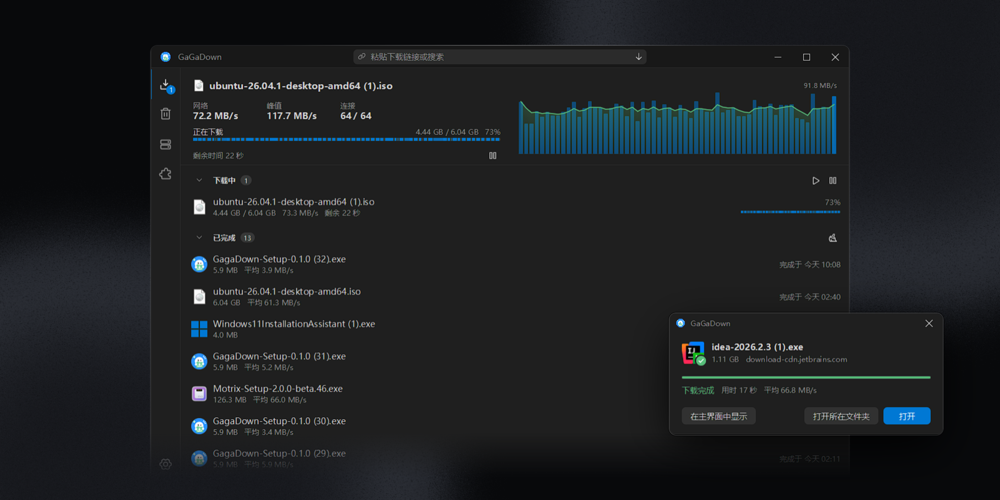

[](https://github.com/shuakami/gagadown/releases)

[简体中文](README.md) | English

GaGaDown is a desktop download manager for Windows and Linux, designed for fast downloads and a minimal interface.

It can take over browser downloads, split files into segments, adjust connection counts, and compare direct and proxy routes.

[Download](https://github.com/shuakami/gagadown/releases) | [Report an issue](https://github.com/shuakami/gagadown/issues)

## Features

- **Dynamic segments:** concurrent workers split remaining ranges and help finish slow segments.
- **Cross-platform:** native Windows and Linux support, including X11 and Wayland.
- **Route selection:** compare direct connections, system proxies and local proxies; remember host-specific routing preferences.
- **Adaptive connections:** adjust concurrency using measured throughput and back off when a source limits requests.
- **Resumable downloads:** use saved progress and `If-Range` validation; restart when the remote file has changed.
- **Selective browser handoff:** reject web pages, authentication failures and unsuccessful responses so the browser can continue handling them.
- **Browser extension:** bundled Chrome and Edge extension; ordinary browser downloads still work when GaGaDown is not running.
- **Background operation:** tray support, launch at login, silent startup and completion notifications on Windows.
- **Native text rasterization:** Windows ClearType support with a grayscale fallback. Rendering quality across DPI scales is being investigated; this is not a claim that the reported blur is resolved.

## Quick start

### Windows

1. Download `GagaDown-Setup-x.y.z.exe` from [Releases](https://github.com/shuakami/gagadown/releases) and run it. A portable executable is also available.
2. Open GaGaDown's browser extension page and follow the instructions for Chrome or Edge.
3. Download files from your browser as usual.

### Linux

```bash
tar xzf GagaDown-*-linux-x86_64.tar.gz
cd GagaDown-*-linux-x86_64
./GagaDown
```

A compatible graphics driver is required. The desktop application uses wgpu and supports X11 and Wayland.

### Browser extension

Open `chrome://extensions` or `edge://extensions` and enable **Developer mode**. Click **Load unpacked**, then select the `extension` folder in GaGaDown's data directory. You can copy this path from the application's browser extension page.

### Command line

```bash
gagadown-cli get <URL> [--dir DIR] [--max-connections N] [--proxy URL] [--direct-only] [--sha256 HEX]
gagadown-cli serve
gagadown-cli proxies
```

## Build from source

```bash
# Linux
cargo build --release -p gagadown-app -p gagadown-cli

# Cross-compile Windows binaries on Linux; requires mingw-w64, nsis and zip
bash tools/package.sh
```

| Directory | Contents |
| --- | --- |
| `crates/gagadown-core` | Download engine, routing, task management and local API |
| `crates/gagadown-app` | Desktop application using egui and wgpu |
| `crates/gagadown-cli` | Command-line interface |
| `crates/gagadown-i18n` | Shared Fluent catalog foundation |
| `extension` | Chrome and Edge extension, Manifest V3 |
| `patches` | Local eframe, epaint and egui-wgpu patches |

Code pushes to `main` trigger GitHub Actions to increment the version, create a tag and publish Windows and Linux artifacts. The localization work branch has a separate validation workflow that does not publish releases.

## License

[GPL-3.0](LICENSE)
